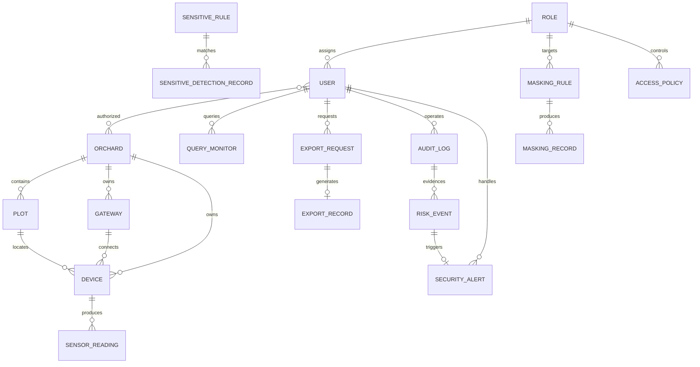

# ER 图

```mermaid
erDiagram
    ROLE ||--o{ USER : assigns
    USER }o--o{ ORCHARD : authorized
    ORCHARD ||--o{ PLOT : contains
    ORCHARD ||--o{ GATEWAY : owns
    ORCHARD ||--o{ DEVICE : owns
    PLOT ||--o{ DEVICE : locates
    GATEWAY ||--o{ DEVICE : connects
    DEVICE ||--o{ SENSOR_READING : produces
    SENSITIVE_RULE ||--o{ SENSITIVE_DETECTION_RECORD : matches
    ROLE ||--o{ MASKING_RULE : targets
    MASKING_RULE ||--o{ MASKING_RECORD : produces
    ROLE ||--o{ ACCESS_POLICY : controls
    USER ||--o{ QUERY_MONITOR : queries
    USER ||--o{ EXPORT_REQUEST : requests
    EXPORT_REQUEST ||--o| EXPORT_RECORD : generates
    USER ||--o{ AUDIT_LOG : operates
    AUDIT_LOG ||--o{ RISK_EVENT : evidences
    RISK_EVENT ||--o| SECURITY_ALERT : triggers
    USER ||--o{ SECURITY_ALERT : handles
```

