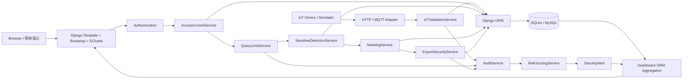

# 系统逻辑架构图

```mermaid
flowchart LR
    B["Browser / 答辩演示"] --> T["Django Template + Bootstrap + ECharts"]
    I["IoT Device / Simulator"] --> H["HTTP / MQTT Adapter"]
    T --> A["Authentication"]
    H --> V["IoTValidationService"]
    A --> P["AccessControlService"]
    P --> Q["QueryLimitService"]
    Q --> S["SensitiveDetectionService"]
    S --> M["MaskingService"]
    M --> E["ExportSecurityService"]
    V --> O["Django ORM"]
    P --> O
    S --> O
    M --> O
    E --> O
    O --> D[("SQLite / MySQL")]
    V --> AU["AuditService"]
    Q --> AU
    E --> AU
    AU --> R["RiskScoringService"]
    R --> AL["SecurityAlert"]
    D --> DB["Dashboard ORM Aggregation"]
    AL --> DB
    DB --> T
```

